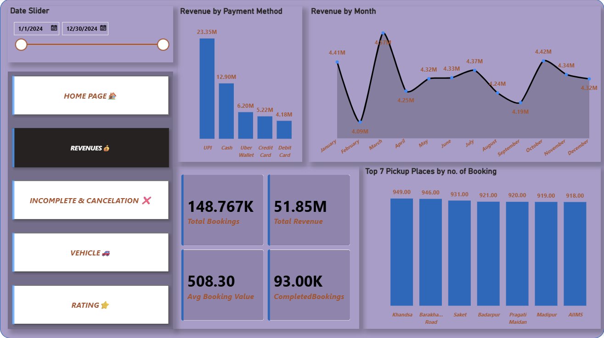
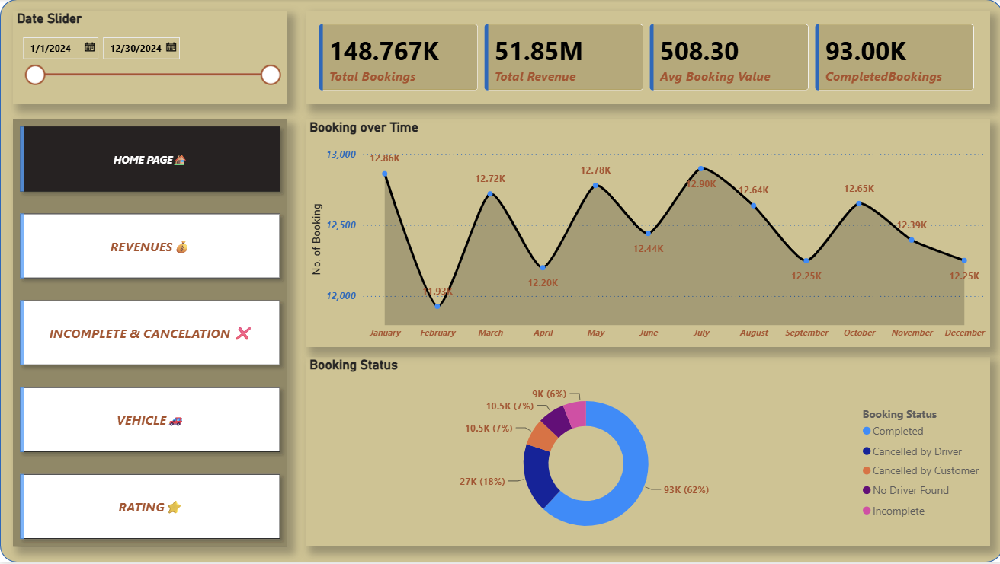
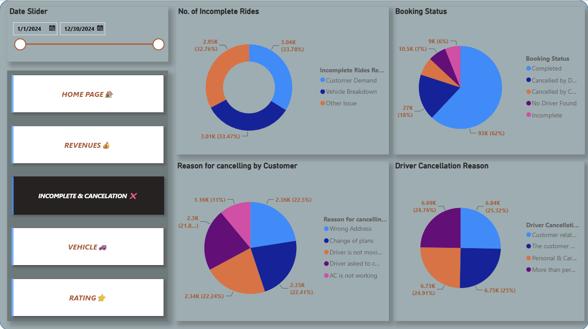
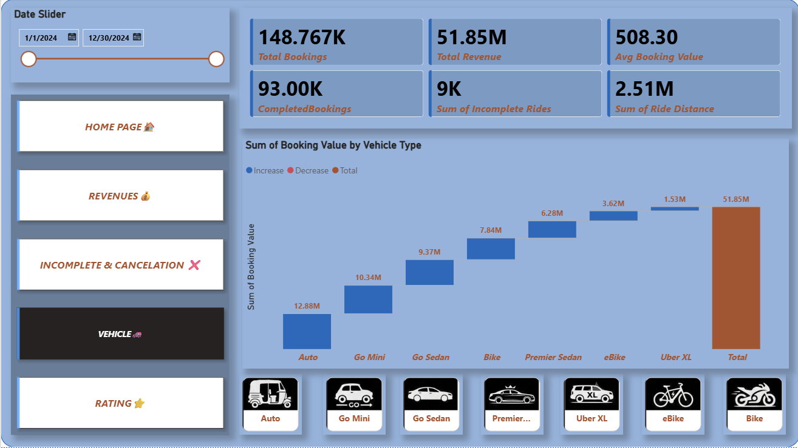
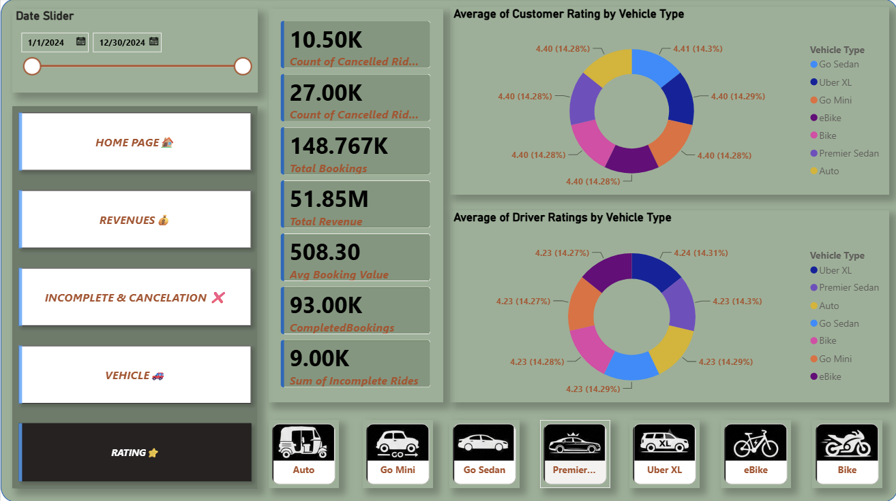

# Uber Ride Analytics Dashboard

An interactive **Power BI** dashboard that analyses **148.8K ride bookings from 2024**: revenue, payment methods, pickup demand, cancellations, vehicles and ratings.



## Why this project

Ride-hailing businesses lose money when bookings are cancelled and miss opportunities when revenue patterns go unnoticed. This dashboard gives a manager one place to see how the business is performing and where to act, with a date slider that filters every chart at once.

It answers four practical questions:

1. How much revenue is the service earning, and how does it change through the year?
2. How do customers pay?
3. Where does demand come from?
4. How many bookings never reach completion?

## Headline numbers

| Total bookings | Total revenue | Average booking value | Completed bookings |
|:---:|:---:|:---:|:---:|
| **148.77K** | **51.85M** | **508.30** | **93.00K** |

## Dashboard pages

| Page | What it shows |
|---|---|
| Home | Landing page and navigation to the rest of the report |
| Revenues | Revenue, payment mix, monthly trend, booking volume and top pickup places |
| Incomplete & Cancellation | Bookings that were cancelled or not completed |
| Vehicle | Performance by vehicle type |
| Rating | Customer and driver ratings |

<!-- Add one screenshot per page -->
<p align="center">
  
  
</p>
<p align="center">
  
  
</p>

## Features

- **Date slider** (1 Jan to 30 Dec 2024) that updates every visual on the page
- **Button navigation** between five report pages
- **KPI cards** for total bookings, total revenue, average booking value and completed bookings
- **Revenue by payment method** (UPI, cash, Uber Wallet, credit card, debit card)
- **Revenue by month** area chart with a label on every month
- **Top 7 pickup places** ranked by number of bookings
- Consistent theme with soft lavender panels, blue charts and rust-coloured labels

## Key insights

- **UPI leads payments.** It brings in 23.35M of 51.85M, about 45% of revenue. Cash is second at about 25%, and digital methods together make up about 75%.
- **Revenue is steady.** Monthly revenue stays near the 4.32M average, from 4.09M in February to a peak of about 4.57M in March.
- **Demand is evenly spread.** The top seven pickup places range from 949 bookings (Khandsa) to 918 (AIIMS), a gap of only about 3%.
- **Many bookings are not completed.** Only about 62.5% of bookings were completed, so roughly 55.8K bookings (about 37.5%) were cancelled or incomplete. This is the biggest opportunity in the data.

## Recommendations

**Increase revenue**
- Move cash riders to digital payments with small cashback or wallet offers.
- Run targeted promotions in the weakest months (February, September, August).
- Study what drove the March and October peaks and plan pricing and supply around it.
- Raise average booking value with premium vehicle options and long-trip bundles.

**Reduce cancellations**
- Break cancellations down by driver-side and customer-side reasons and fix the largest first.
- Show trip distance and fare before drivers accept, and reward completion streaks.
- Match the nearest driver and show accurate arrival times to shorten waits.
- Offer a short free-cancellation window, then a small fee, and re-match failed bookings quickly.

**Improve customer satisfaction**
- Break ratings down by vehicle type, location and driver to find weak spots.
- Follow up low ratings within 24 hours and ask for a reason.
- Coach low-rated drivers and recognise top-rated ones.
- Handle failed payments cleanly and refund incomplete rides automatically.

The full write-up, with a metric to track for each action, is in [`docs/Uber_Ride_Dashboard_Project_Documentation.docx`](docs/Uber_Ride_Dashboard_Project_Documentation.docx).

## Tech stack

- **Microsoft Power BI Desktop**
- Dataset: *[add dataset name and link]*

## Repository structure

```
.
├── Uber_Ride_Dashboard.pbix        # Power BI report file
├── images/                         # Dashboard screenshots
├── docs/
│   └── Uber_Ride_Dashboard_Project_Documentation.docx
└── README.md
```

## How to open the dashboard

1. Download or clone this repository.
2. Install [Power BI Desktop](https://powerbi.microsoft.com/desktop/) (free, Windows).
3. Open `Uber_Ride_Dashboard.pbix` and use the date slider and page buttons to explore.

## Possible improvements

- Add completion rate and cancellation rate cards to the Revenues page.
- Widen the pickup places chart so long names are not truncated.
- Add hover tooltips and a clear filters button.
- Publish to the Power BI Service and link the live report here.

## Author

**Shubham Khatri**
[GitHub](https://github.com/shubham7khatri) · [LinkedIn](https://linkedin.com/in/shubham-khatri-0a0883288) · shubham7khatri@gmail.com
